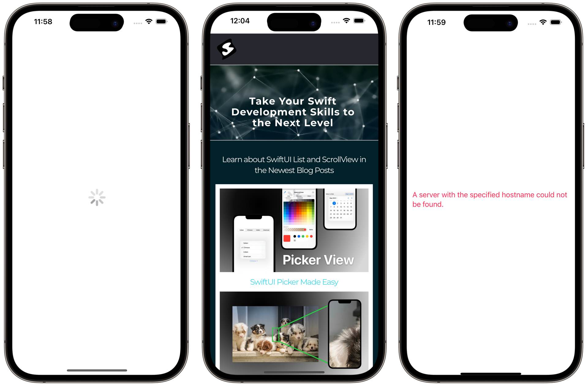
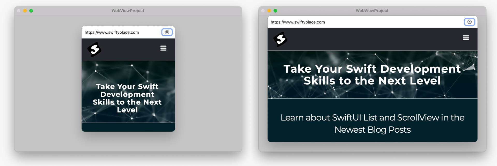
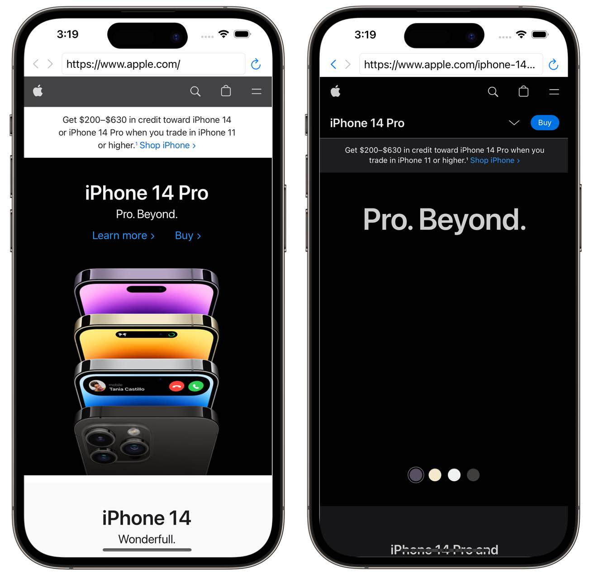

# WebViewProject
Demo project to work with Webkit in SwiftUI

Read how this code works in this tutorial: https://www.swiftyplace.com/blog/loading-a-web-view-in-swiftui-with-wkwebview

## Webview with Loading indicator and Error handling

## Making a Webview component in SwiftUI that works for iOS and macOS

## in-app browser with Webkit
you can navigate back and forward or reload a website

